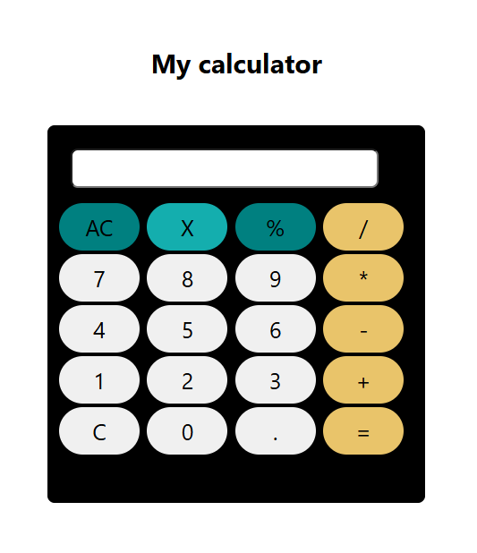

# 🧮 Calculator App

A simple and responsive calculator web application built using **HTML**, **CSS**, and **JavaScript**. This app performs basic arithmetic operations including addition, subtraction, multiplication, and division.

## 📸 Preview



## 🚀 Features

- User-friendly interface
- Performs basic arithmetic calculations
- Responsive design suitable for desktop and mobile
- Built using only vanilla HTML, CSS, and JavaScript (no frameworks)

## 🛠️ Tech Stack

- **HTML5**
- **CSS3**
- **JavaScript (ES6)**

## 📁 Project Structure

```plaintext
📦 calculator_app
├── calculator.html
├── style.css
├── calculator.js
└── calculator_preview.PNG
